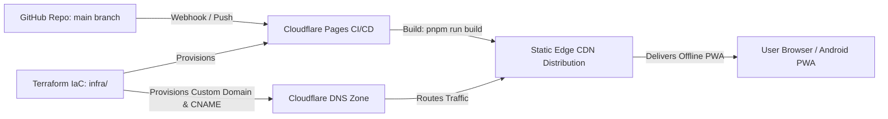

# Deployment Guide: Ride Stat Overlay PWA

This guide details how to deploy the **Ride Stat Overlay** Progressive Web App to **Cloudflare Pages** with automated custom domain mapping and DNS management using Terraform Infrastructure-as-Code (IaC).

---

## 1. Architecture Overview



- **Frontend**: SvelteKit 5 Single Page Application pre-rendered with `@sveltejs/adapter-static` (`build/`).
- **Edge Hosting**: Cloudflare Pages with worldwide CDN caching, HTTP/3, and automatic TLS.
- **Infrastructure as Code**: Terraform configuration in `infra/` managing the Pages project, GitHub integration, build parameters, custom domain binding, and proxied DNS CNAME records.

---

## 2. Prerequisites

1. **Cloudflare Account**:
   - An active Cloudflare account.
   - An active domain/zone managed by Cloudflare DNS (e.g. `example.com`).
2. **GitHub Account**:
   - Repository pushed to GitHub (e.g. `https://github.com/<owner>/<repo>`).
   - Cloudflare GitHub App authorized on the account (one-time setup).
3. **Local Tooling**:
   - `terraform` (`>= 1.5.0`)
   - `node` (`>= 24.0.0`)
   - `pnpm` (`>= 9.0.0`)

---

## 3. Step 1: Gather Cloudflare Credentials & IDs

### 3.1 Retrieve Account ID & Zone ID

1. Log in to the **[Cloudflare Dashboard](https://dash.cloudflare.com/)**.
2. Select your domain from the **Websites** list (e.g. `example.com`).
3. In the **Overview** page (right-hand sidebar under **API**):
   - Copy the **Account ID**.
   - Copy the **Zone ID**.

### 3.2 Create Cloudflare API Token

1. Go to **[Cloudflare API Tokens](https://dash.cloudflare.com/profile/api-tokens)**.
2. Click **Create Token** → **Create Custom Token** (at the bottom).
3. Name the token (e.g. `ride-overlay-terraform`).
4. Configure the following permissions:
   - **Account Permissions**:
     - `Cloudflare Pages`: **Edit**
   - **Zone Permissions**:
     - `DNS`: **Edit**
     - `SSL and Certificates`: **Read**
     - `Zone`: **Read**
5. **Account Resources**: Include → _All accounts_ (or your specific account).
6. **Zone Resources**: Include → _Specific zone_ → Select your domain (e.g. `example.com`).
7. Click **Continue to summary** → **Create Token**.
8. Copy and securely store the generated API token.

---

## 4. Step 2: Authorize Cloudflare Pages GitHub App

If you have not previously connected Cloudflare Pages to your GitHub account:

1. In Cloudflare Dashboard, navigate to **Workers & Pages** → **Create Application** → **Pages** → **Connect to Git**.
2. Authenticate with GitHub and grant Cloudflare access to your repository (e.g. `Merge`).
3. _Note: You can cancel the manual wizard after authorizing; Terraform will manage the project configuration._

---

## 5. Step 3: Configure Terraform Variables

1. Navigate to the `infra/` directory and copy the template:

   ```bash
   cd infra
   cp terraform.tfvars.example terraform.tfvars
   ```

2. Edit `infra/terraform.tfvars` with your credentials and target domain:
   ```hcl
   # Cloudflare Credentials
   cloudflare_api_token  = "your-cloudflare-api-token"
   cloudflare_account_id = "your-cloudflare-account-id"
   cloudflare_zone_id    = "your-cloudflare-zone-id"

   # Domain & Project Configuration
   domain                = "ride.example.com"       # Target custom domain/subdomain
   project_name          = "ride-stat-overlay"      # Cloudflare Pages project name

   # GitHub Repository Binding
   github_owner          = "your-github-username"   # GitHub username or organization
   github_repo           = "Merge"                  # Repository name
   ```

---

## 6. Step 4: Apply Terraform Infrastructure

1. Initialize the Terraform Cloudflare provider:

   ```bash
   terraform init
   ```

2. Preview the resources to be provisioned:

   ```bash
   terraform plan
   ```

3. Apply the configuration:
   ```bash
   terraform apply
   ```

### What Terraform Provisions:

- **`cloudflare_pages_project.pwa`**:
  - Connects to your GitHub repository on branch `main`.
  - Configures build command `pnpm run build` and publish directory `build`.
  - Configures build environment variables (`NODE_VERSION = "24"`, `PNPM_VERSION = "11"`, `PUBLIC_DOMAIN = "https://${var.domain}"`).
- **`cloudflare_pages_domain.custom_domain`**:
  - Registers the custom domain (e.g. `ride.example.com`) to the Pages project.
- **`cloudflare_record.pages_cname`**:
  - Creates a proxied `CNAME` DNS record pointing `ride.example.com` to `ride-stat-overlay.pages.dev`.

---

## 7. Step 5: Verification & Testing

1. **Verify Deployment in Cloudflare**:
   - Go to **Workers & Pages** → **ride-stat-overlay** in the Cloudflare dashboard.
   - Check the **Deployments** tab to verify that Cloudflare automatically kicked off the initial production build.

2. **Verify Custom Domain & SSL**:
   - Visit `https://ride.example.com` (or your configured domain).
   - Verify that SSL/TLS is active and the PWA loads.

3. **Verify PWA Features**:
   - Open browser developer tools → **Application** tab:
     - **Manifest**: Check that `manifest.json` is detected with icons and standalone display mode.
     - **Service Workers**: Confirm `service-worker.js` is registered and active.
   - **Offline Test**: Toggle "Offline" in developer tools network panel and reload; the app should load instantly from service worker cache.
   - **Install Test**: Click the "Install App" button in the header or browser address bar.

---

## 8. Continuous Deployment Workflow

Once Terraform has provisioned the stack:

- Every `git push` to `main` automatically triggers a production build and edge deployment on Cloudflare Pages.
- Pull Requests automatically trigger the GitHub Actions CI workflow (`.github/workflows/ci.yml`) to validate formatting (`pnpm run format:check`), linting (`pnpm run lint`), TypeScript checks (`pnpm run check`), and static builds.

---

## 9. Teardown / Destroy

To decommission the Cloudflare Pages project and DNS records:

```bash
cd infra
terraform destroy
```
